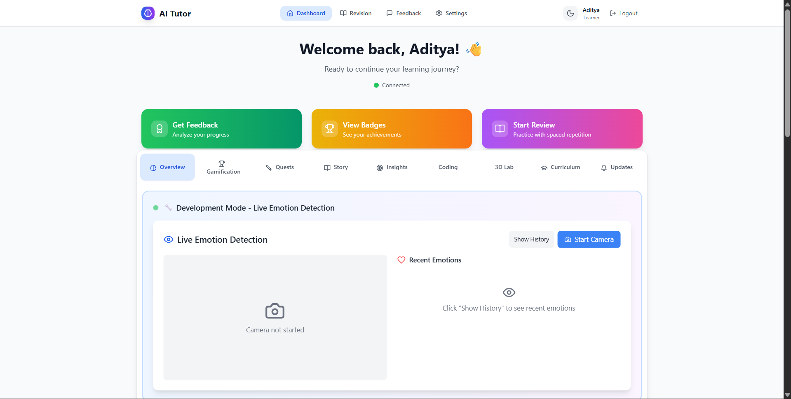

# NeuroLearn - AI-Powered Learning Platform


A comprehensive AI-powered learning platform that combines emotion detection, adaptive learning, gamification, and intelligent tutoring systems to create personalized educational experiences.

## 🏠 Homepage Preview

<div align="center">
  
  <div style="display:none; background: linear-gradient(135deg, #667eea 0%, #764ba2 100%); border-radius: 8px; padding: 60px 20px; text-align: center; color: white;">
    <h3 style="margin: 0 0 20px 0; font-size: 24px;">🖼️ Homepage Preview</h3>
    <p style="margin: 0; font-size: 16px; opacity: 0.9;">Add your HomePage.png screenshot to assets/images/screenshots/</p>
    <p style="margin: 10px 0 0 0; font-size: 14px; opacity: 0.8;">📱 Modern, responsive design with AI-powered features</p>
  </div>
</div>

## 🚀 Features

### Core Learning Features
- **AI Tutoring System**: Intelligent adaptive tutoring with real-time feedback
- **Emotion Detection**: Real-time emotion recognition to adapt teaching methods
- **Learning DNA**: Unique learning profile creation and analysis
- **Spaced Repetition**: Science-backed retention optimization
- **Gamification**: Quest system, badges, and achievement tracking
- **Co-learning**: Collaborative learning experiences and peer interaction
- **Knowledge Graph**: Visual representation of learning progress and connections

### Advanced Features
- **Story-driven Learning**: Immersive narrative-based educational content
- **Debate System**: AI-powered debate facilitation and analysis
- **Sandbox Environment**: Safe experimental learning space
- **Performance Analytics**: Comprehensive learning analytics and insights
- **Personalization Engine**: ML-driven content recommendation system

## 🏗️ Architecture

```
NeuroLearn/
├── backend/                    # Python Flask backend
│   ├── aitutor_backend/       # Main application package
│   │   ├── routes/             # API endpoints
│   │   ├── services/           # Business logic
│   │   ├── models.py           # Database models
│   │   └── utils/              # Utility functions
│   ├── Face-Emotion-Detector/ # Emotion detection module
│   ├── scripts/               # Startup scripts
│   ├── requirements.txt       # Python dependencies
│   └── aitutor.db            # Development database
├── frontend/                   # React.js frontend
│   ├── dashboard/            # Main dashboard application
│   │   ├── src/               # Source code
│   │   ├── package.json       # Dependencies
│   │   └── vite.config.js     # Build configuration
│   └── integration-examples/   # Integration examples
├── documentation/             # Comprehensive documentation
│   ├── api.md                 # API documentation
│   ├── backend.md             # Backend architecture
│   ├── frontend.md            # Frontend components
│   ├── emotion-detection.md   # ML system guide
│   ├── deployment.md          # Deployment guide
│   └── architecture-overview.md # System overview
├── deployment/               # Deployment configurations
│   ├── render.yaml           # Render deployment
│   ├── netlify.toml          # Netlify deployment
│   └── Procfile              # Process configuration
├── package.json              # Root package configuration
├── .gitignore               # Git ignore rules
└── README.md               # Project documentation
```

## 🛠️ Technology Stack

### Backend
- **Python 3.10+** - Core backend language
- **Flask** - Web framework
- **SQLAlchemy** - Database ORM
- **OpenCV** - Computer vision for emotion detection
- **TensorFlow/PyTorch** - ML model training
- **WebSocket** - Real-time communication

### Frontend
- **React 18** - Frontend framework
- **Vite** - Build tool and dev server
- **Tailwind CSS** - Styling framework
- **Framer Motion** - Animations
- **Three.js** - 3D graphics for visualizations
- **Socket.io** - Real-time features
- **Zustand** - State management

### Additional Tools
- **D3.js** - Data visualization
- **Monaco Editor** - Code editor integration
- **recharts** - Chart components

## 🚦 Quick Start

### Prerequisites
- Python 3.10+
- Node.js 16+
- npm/yarn

### Installation Options

#### Option 1: Full Stack Development
```bash
# Install all dependencies
npm run install:all

# Start full development environment
npm run dev
```

#### Option 2: Separate Backend/Frontend Setup

**Backend Setup**
```bash
# Navigate to backend directory
cd backend

# Install Python dependencies
pip install -r requirements.txt

# Initialize database
python -c "from aitutor_backend import create_app, db; app = create_app(); db.create_all()"

# Start backend server
python scripts/start_server.py
```

**Frontend Setup**
```bash
# Install root dependencies
npm install

# Start frontend development server
npm run frontend:dev
```

### Environment Variables

Create `.env` files in respective directories:

**Backend (.env)**
```
FLASK_ENV=development
DATABASE_URL=sqlite:///aitutor.db
SECRET_KEY=your-secret-key
OPENAI_API_KEY=your-openai-key
```

**Frontend (.env)**
```
VITE_API_URL=http://localhost:5000
VITE_WEBSOCKET_URL=ws://localhost:5000
```

## 📚 Documentation

- [API Documentation](documentation/api.md)
- [Frontend Components](documentation/frontend.md)
- [Backend Services](documentation/backend.md)
- [Emotion Detection Guide](documentation/emotion-detection.md)
- [Deployment Guide](documentation/deployment.md)

## 🧪 Testing

```bash
# Backend tests
python -m pytest backend/tests/

# Frontend tests
cd frontend/dashboard && npm test
```

## 📊 Project Structure Details

### Backend (`aitutor_backend/`)
- **routes/**: API endpoint definitions
- **services/**: Business logic and ML services
- **models/**: Database models
- **utils/**: Utility functions and helpers

### Frontend (`frontend/dashboard/src/`)
- **components/**: Reusable UI components
- **pages/**: Main application pages
- **hooks/**: Custom React hooks
- **contexts/**: React context providers
- **utils/**: Frontend utility functions

## 🔧 Configuration

- **Backend**: Configure in `config.py`
- **Frontend**: Configure via environment variables
- **Database**: SQLite for development, PostgreSQL for production

## 🚀 Deployment

The platform supports multiple deployment options:
- **Render**: See `render.yaml`
- **Vercel**: See `vercel.json`
- **Netlify**: See `netlify.toml`

## 🤝 Contributing

1. Fork the repository
2. Create a feature branch
3. Commit your changes
4. Push to the branch
5. Create a Pull Request

## 📄 License

This project is licensed under the MIT License - see the [LICENSE](LICENSE) file for details.

## 🏆 Features Showcase

### For Recruiters & Tech Leads

**Technical Excellence:**
- Clean, modular architecture with separation of concerns
- RESTful API design with comprehensive documentation
- Real-time WebSocket implementation for collaborative features
- Advanced ML integration with emotion detection
- Scalable database design with SQLAlchemy ORM

**User Experience:**
- Responsive design with Tailwind CSS
- Smooth animations with Framer Motion
- Interactive 3D visualizations
- Real-time collaborative features with OpenCV
- Comprehensive analytics dashboard

**Industry Standards:**
- Modern React patterns (hooks, context, custom hooks)
- TypeScript-ready frontend architecture
- Comprehensive error handling
- Security best practices
- Testing framework integration

## 📞 Contact

For questions about this project, please reach out to the development team.

---

*Built with ❤️ for the future of education*